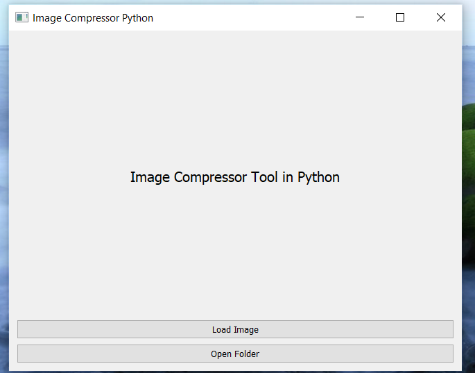
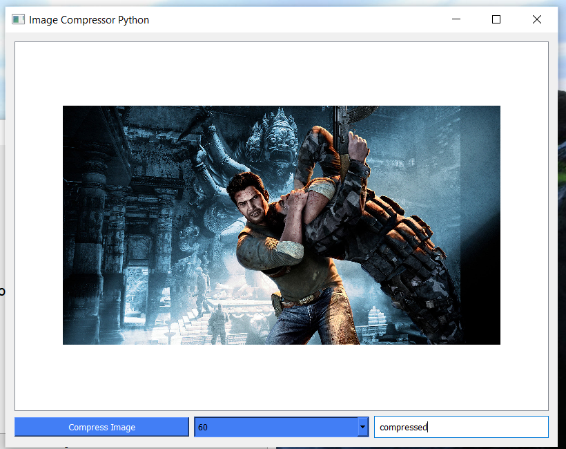

# Image Compressor Tool in Python


A GUI based tool for compressing images with options of selecting the new file name and the quality percentage. PyQT5 is based on C++ UI framework called QT. It is useful to compress images which we often do on-line before uploading it to our social media handles.

## Features 

Supports compression of single file as well as all images of a selected folder. 

## Installation

- Create a new Virtual environment and install packages from requirements.txt file.
- If you want to run the app in development mode then simply switch to the virtual environment and run the main.py file.

## Production 

- Install 'pyinstaller' and run the following command

```
pyinstaller main.py --windowed
```

This would create a dist folder inside of which you'd find your exe file which you can use to run the application.

## Screenshots



Home Menu screenshot, we can add a file or a folder and get started with image compression.



Bottom menu allows you to choose quality and name for the compressed file.


Read the [CONTRIBUTING.md](CONTRIBUTING.md) file.
